# SIMULORAN System Architecture & Technical Design

## 1. Overview
SIMULORAN is an interactive, physics-based radio-navigation simulation suite engineered for Loran-C and eLoran systems. It models hyperbolic time-difference of arrival (TDOA) positioning, pseudorange multilateration, atmospheric refraction, oscillator stability, Additional Secondary Factor (ASF) groundwave propagation, terrain diffraction, electronic warfare countermeasures, and multi-sensor GNSS/eLoran fusion.

```mermaid
flowchart TB
    subgraph UI_Layer["User Interface & Presentation Layer"]
        Views["SPA Route Views<br/>(/, /loran-c, /eloran, /waveforms, /learn, /about)"]
        Components["Component Panels<br/>(Telemetry, Tracking, Asf, Fusion, SdrLab)"]
        Map["MapLibre GL & Canvas Overlays<br/>(Vector Basemaps / Offline Radar Canvas)"]
    end

    subgraph State_Layer["Reactive State Management (Zustand)"]
        SimStore["simulationStore.js<br/>(Transmitters, Receiver, Kinematics, EW, Noise)"]
        ThemeStore["themeStore.js<br/>(Dark / Light Radar Mode)"]
    end

    subgraph Worker_Layer["Off-Thread Concurrency (Web Workers)"]
        PhysicsWorker["physicsWorker.js<br/>(TDOA Solver, EKF, RAIM, GDOP Grid)"]
        AsfWorker["gridWorker.js / asfWorker.js<br/>(Millington ASF Terrain Mesh)"]
        SdrWorker["sdrWorker.js<br/>(100 kHz Baseband Synthesizer & DSP)"]
    end

    subgraph Physics_Core["Mathematical Physics Engine (src/lib/)"]
        Pulse["pulse.js<br/>(CCIR Pulse Envelope & Phase Codes)"]
        Grwave["grwave.js<br/>(Sommerfeld / Norton / Millington Groundwave)"]
        Tdoa["tdoa.js / geodesy.js<br/>(Vincenty Ellipsoidal Geodesics)"]
        Ekf["ekf.js / fusion.js<br/>(6-State Extended Kalman Filter & BLUE)"]
        Terrain["elevationProfile.js / terrainMasking.js<br/>(ITU-R P.526 Knife-Edge Diffraction)"]
        EW["electronicWarfare.js<br/>(J/S Jamming & Spoofing Detectors)"]
    end

    subgraph Runtime_Targets["Multi-Platform Runtime Targets"]
        Web["Web SPA (Vercel / Nginx)"]
        Docker["Docker Container (nginx:1.27-alpine)"]
        Desktop["Desktop App (Electron 33)"]
    end

    UI_Layer --> State_Layer
    State_Layer --> Worker_Layer
    Worker_Layer --> Physics_Core
    Physics_Core --> State_Layer
    Runtime_Targets --> UI_Layer
```



---

## 2. Directory Layout & Module Boundaries

```
simuloran/
├── .github/                 # GitHub Actions workflows & issue templates
├── docs/                    # Research whitepaper, mathematical validation, & provenance
│   ├── evidence/            # Archival literature JSONs and verified crossref records
│   ├── verification/        # Visual regression and verification screenshot testbeds
│   └── README.md            # Comprehensive documentation catalog
├── e2e/                     # Playwright end-to-end and visual regression test suites
├── electron/                # Desktop Electron field container runtime
├── public/                  # Static assets, vector tiles, icons, and scenario examples
├── scripts/                 # Automated verification gates, tile sync, and test harnesses
├── src/
│   ├── components/          # React presentation layer
│   │   ├── charts/          # Oscilloscopes, spectrum analyzers, Stanford diagrams
│   │   ├── map/             # MapLibre GL map engine & ASF heatmap canvas layers
│   │   ├── modals/          # NMEA serial streaming terminal
│   │   ├── panels/          # Telemetry, station editor, trajectory, and EW controls
│   │   ├── seo/             # Structured data, OpenGraph, and meta injection
│   │   └── ui/              # Accessible design primitives (Sliders, Toggles, Tooltips)
│   ├── data/                # Transmitter chain definitions, presets, and geo-boundaries
│   ├── hooks/               # Custom React hooks (ASF heatmaps, resize, animation)
│   ├── lib/                 # Pure mathematical physics algorithms & unit tests
│   │   └── __tests__/       # 37 Vitest test suites covering 100% of mathematical formulas
│   ├── pages/               # Top-level view controllers
│   ├── state/               # Zustand reactive global state stores
│   └── workers/             # Dedicated Web Workers for physics, grid, and SDR synthesis
├── Dockerfile               # Production multi-stage container build
├── docker-compose.yml       # Production container orchestration
├── nginx.conf               # Hardened reverse proxy & SPA static asset server
└── vercel.json              # Serverless configuration with strict security headers
```

---

## 3. Core Physics & Algorithmic Modules

| Module | Location | Primary Standard / Reference | Mathematical Responsibility |
|---|---|---|---|
| **Pulse Envelope** | `src/lib/pulse.js` | USCG COMDTINST M16562.4A | CCIR 100 kHz pulse shape: $i(t) = t^2 e^{-2t/65} sin(omega_0 t + P_{code})$ |
| **Groundwave Propagation** | `src/lib/grwave.js` | ITU-R P.368-10 & Millington (1949) | Numerical Sommerfeld attenuation over mixed seawater/land paths |
| **Ellipsoidal Geodesics** | `src/lib/geodesy.js` | Vincenty (1975) & Brunavs (1977) | WGS-84 geodesic distances, azimuths, and ellipsoidal TDOA baselines |
| **Navigation Solver** | `src/lib/tdoa.js` | Fang (1990) & Pelgrum (2006) | Hyperbolic TDOA intersection via Gauss-Newton nonlinear least-squares |
| **Multi-Sensor Fusion** | `src/lib/fusion.js` | Gelb (1974) & Kay (1993) | Best Linear Unbiased Estimator (BLUE) & covariance error ellipses |
| **Trajectory Kinematics** | `src/lib/trajectory.js` | Doerfler & Last (1997) | Waypoint spline kinematic simulation with carrier Doppler shift modeling |
| **Electronic Warfare** | `src/lib/electronicWarfare.js` | USCG R&D (2007) | GNSS jamming J/S calculation and spoofing detection via eLoran crosscheck |
| **Loran Data Channel** | `src/lib/ldc.js` | RTCM MPS & Eurofix | 32-PPM 9th-pulse modulation and secondary-pulse Eurofix demodulation |
| **Terrain Diffraction** | `src/lib/terrainMasking.js` | ITU-R P.526-15 | Multiple knife-edge obstacle diffraction and Fresnel clearance zones |
| **SDR Baseband DSP** | `src/lib/sdrPlayback.js` | Software-Defined Radio | Synthetic 100 kHz baseband generation, matched filtering, and audio playback |

---

## 4. Off-Thread Computing & Web Workers
To maintain a responsive 60 FPS user interface during complex matrix operations:
- **`physicsWorker.js`**: Computes real-time TDOA position solutions, Extended Kalman Filter (EKF) step updates, GDOP surface grids, and receiver autonomous integrity monitoring (RAIM).
- **`gridWorker.js`**: Evaluates high-resolution spatial Additional Secondary Factor (ASF) maps across thousands of geographic points using Millington boundary integrals.
- **`sdrWorker.js`**: Synthesizes synthetic baseband I/Q samples, computes fast Fourier transforms (FFT) for spectral waterfalls, and filters baseband signals without blocking the DOM thread.

---

## 5. Security & Deployment Posture
- **Strict Content Security Policy (CSP)**: Disallows unauthorized external scripts; explicitly permits trusted OpenFreeMap vector tile domains and local Web Worker blobs.
- **Zero-Dependency Tile Fallback**: Features an air-gapped HTML5 Canvas Radar basemap mode that operates without external network dependencies.
- **Offline Scenario Presets**: Air-gapped scenario presets and GeoJSON station exports allow reproducible, self-contained testing.
- **Production Containerization**: Multi-stage Docker container deployed on `nginx:1.27-alpine` with unprivileged execution, security headers, and automated health checks.
