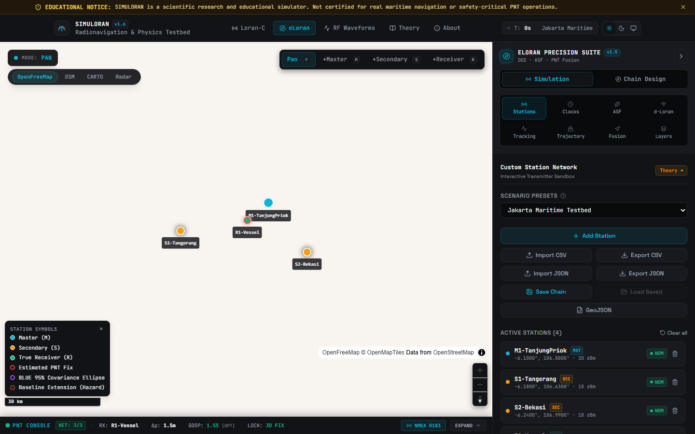
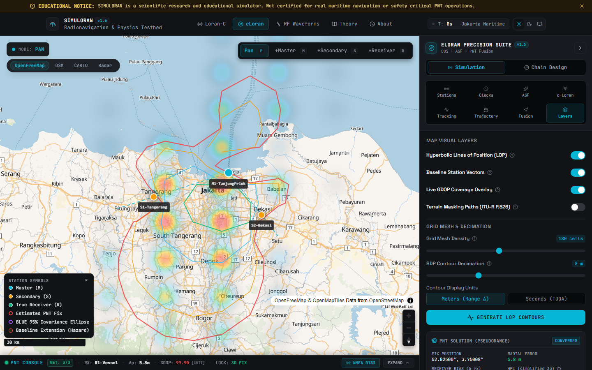
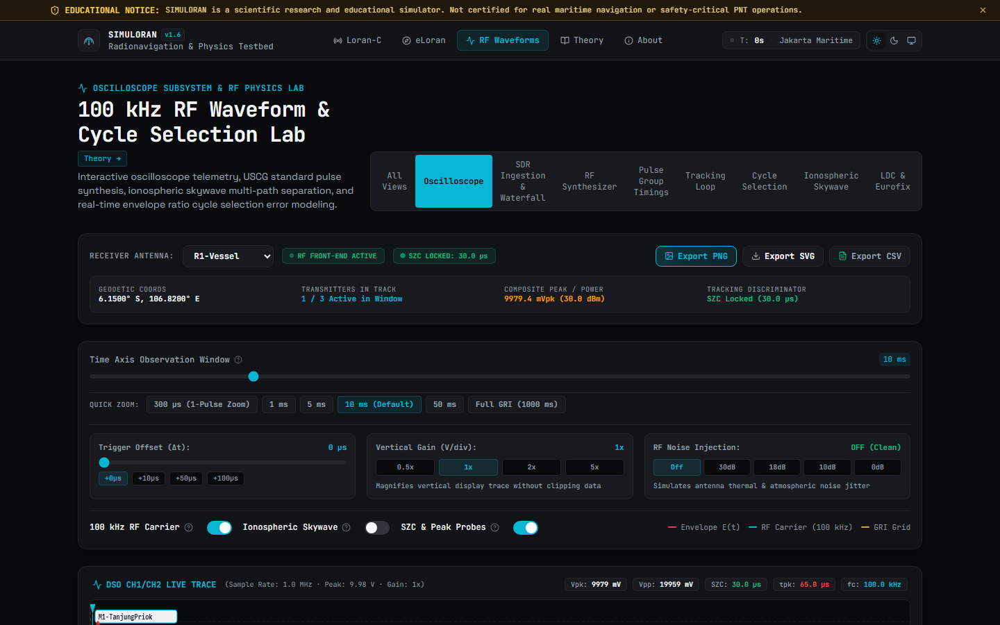
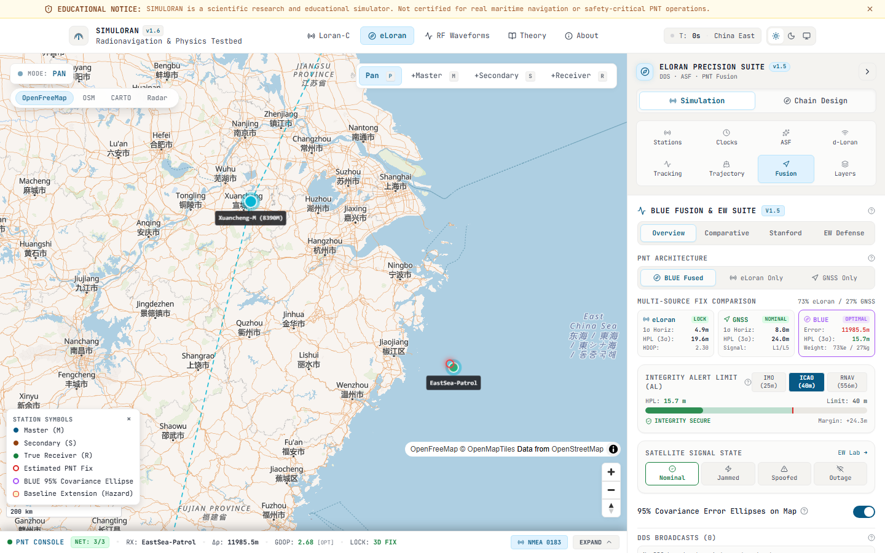
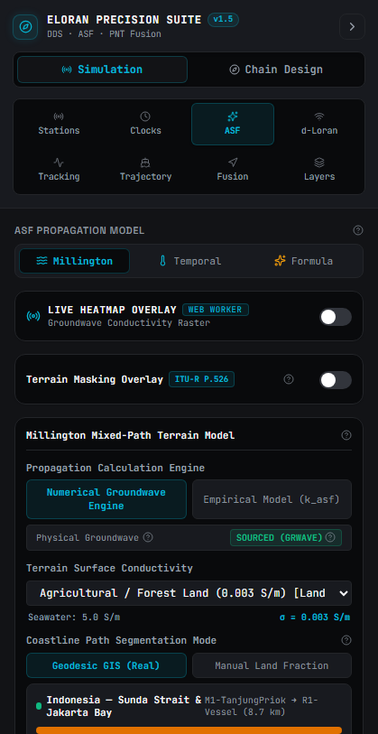
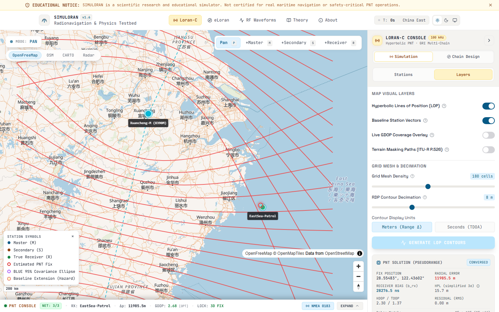
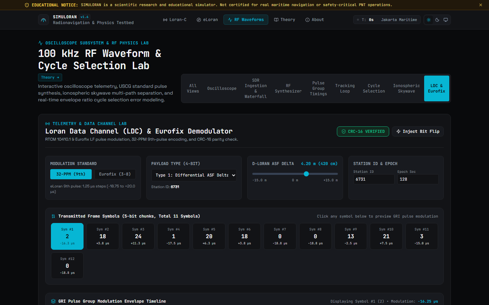
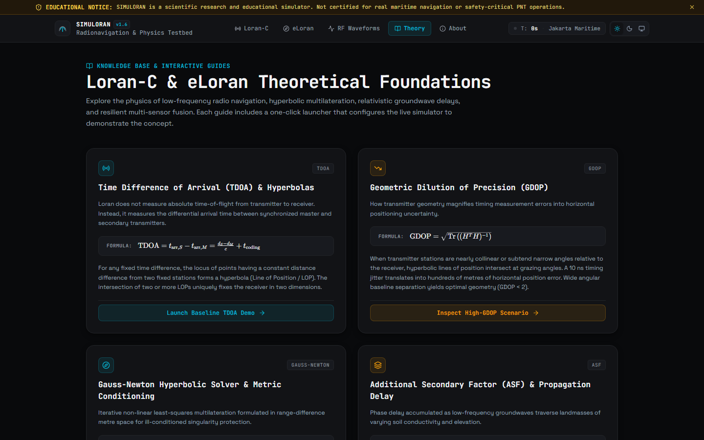

# SIMULORAN

> **High-Fidelity Loran-C & eLoran Simulation Suite**  
> An interactive, physics-based radio-navigation engineering laboratory for hyperbolic time-difference of arrival (TDOA) positioning, pseudorange multilateration, atmospheric refraction, oscillator stability, Additional Secondary Factor (ASF) modeling, and GNSS-resilient multi-sensor fusion.

> [!CAUTION]
> **EDUCATIONAL & RESEARCH SIMULATOR ONLY**  
> SIMULORAN is an academic and engineering research simulation tool. It is **not** certified, approved, or intended for real-world maritime navigation, aviation, or safety-critical positioning, navigation, and timing (PNT).

---

## 1. Overview & Motivation

Global Navigation Satellite Systems (GNSS: GPS, Galileo, BeiDou, GLONASS) transmit ultra-low-power microwave signals (~1.5 GHz) from ~20,000 km in medium Earth orbit. As a consequence, satellite signals are highly susceptible to intentional jamming, spoofing, multipath degradation, and solar space weather events.

**eLoran (enhanced Loran)** is the internationally standardized, terrestrial, low-frequency (100 kHz) navigation system providing high-power (hundreds of kilowatts to megawatts) signals that share no common failure modes with GNSS, delivering resilient, autonomous Positioning, Navigation, and Timing (PNT).

**SIMULORAN** is a standalone, web-based engineering simulation suite designed to model, visualize, and analyze hyperbolic and pseudorange radio navigation chains with mathematical rigor.

---


---

## Visual Showcase & Layout Overview

SimuLoran provides a high-density, professional dark-mode maritime radio-navigation workbench. Below is a visual tour of the primary operational views shown at full width. For complete step-by-step operating procedures, parameter definitions, and workflows, consult the **[Visual User Guide](docs/VISUAL_USER_GUIDE.md)**.

### 1. eLoran All-in-View Pseudorange Multilateration & Radial Geometry

[](docs/VISUAL_USER_GUIDE.md#4-eloran-pseudorange-multilateration-all-in-view)

*Real-time all-in-view pseudorange multilateration on MapLibre vector charts. Features synchronized station radials, dynamic receiver clock bias ($b_{rx}$) estimation via Weighted Least Squares (WLS), and covariance error ellipses. [Read detailed guide →](docs/VISUAL_USER_GUIDE.md#4-eloran-pseudorange-multilateration-all-in-view)*

---

### 2. Real-Time Geometric Dilution of Precision (GDOP) & Coverage Contours

[](docs/VISUAL_USER_GUIDE.md#6-real-time-geometric-dilution-of-precision-gdop-contours)

*Real-time multi-station GDOP and HDOP coverage contour rasterization using an off-thread Web Worker. Renders Jet/Viridis colormaps with configurable operational threshold isolines (GDOP ≤ 1.5, 3.0, 5.0). [Read detailed guide →](docs/VISUAL_USER_GUIDE.md#6-real-time-geometric-dilution-of-precision-gdop-contours)*

---

### 3. 100 kHz RF Waveform Workbench & Standard Zero-Crossing (SZC) Oscilloscope

[](docs/VISUAL_USER_GUIDE.md#13-rf-waveforms-workbench--pulse-oscilloscope)

*High-precision digital oscilloscope synthesizing the USCG standardized 100 kHz pulse: $i(t) = A (t-\tau)^2 e^{-2(t-\tau)/65} \sin(0.2\pi t)$. Shows envelope derivative tracking, the 3rd zero-crossing (SZC at 30 µs), and spectral FFT containment. [Read detailed guide →](docs/VISUAL_USER_GUIDE.md#13-rf-waveforms-workbench--pulse-oscilloscope)*

---

### 4. GNSS-eLoran Multi-Sensor Fusion & Resilient Anti-Jamming Lab

[](docs/VISUAL_USER_GUIDE.md#9-gnss-eloran-sensor-fusion--resilience-lab)

*Inverse-covariance Best Linear Unbiased Estimator (BLUE) sensor fusion. Dynamically weights satellite pseudoranges against high-power terrestrial eLoran signals, maintaining resilient PNT fix continuity during severe GNSS jamming and spoofing attacks. [Read detailed guide →](docs/VISUAL_USER_GUIDE.md#9-gnss-eloran-sensor-fusion--resilience-lab)*

---

### 5. Additional Secondary Factor (ASF) & Millington Mixed-Path Propagation

[](docs/VISUAL_USER_GUIDE.md#7-additional-secondary-factor-asf--millington-propagation)

*Multi-segment boundary groundwave phase delay modeling following ITU-R P.368 and Millington's method. Computes forward and reverse boundary field strengths across varying conductivities (seawater $\sigma=5.0\text{ S/m}$, agricultural land, rocky terrain). [Read detailed guide →](docs/VISUAL_USER_GUIDE.md#7-additional-secondary-factor-asf--millington-propagation)*

---

### 6. Loran-C Hyperbolic Time-Difference of Arrival (TDOA) Navigation

[](docs/VISUAL_USER_GUIDE.md#3-loran-c-hyperbolic-time-difference-navigation)

*Classical hyperbolic radio-navigation showing master and secondary stations, hyperbolic Lines of Position (LOPs), baseline extension geometry, and time difference measurements ($\text{TD}_X, \text{TD}_Y$). [Read detailed guide →](docs/VISUAL_USER_GUIDE.md#3-loran-c-hyperbolic-time-difference-navigation)*

---

### 7. Loran Data Channel (LDC) 32-PPM Demodulator & Telemetry

[](docs/VISUAL_USER_GUIDE.md#17-loran-data-channel-ldc-demodulator)

*32-State Pulse Position Modulation (32-PPM) demodulator and Eurofix 9th-pulse decoder with Reed-Solomon RS(31,15) forward error correction for differential corrections and UTC synchronization. [Read detailed guide →](docs/VISUAL_USER_GUIDE.md#17-loran-data-channel-ldc-demodulator)*

---

### 8. Interactive Physics Theory & Empirical Trial Benchmarks

[](docs/VISUAL_USER_GUIDE.md#18-learn-page--interactive-physics-theory)

*Dedicated educational laboratory featuring KaTeX-rendered equations, ellipsoidal geodesic derivations (Andoyer-Lambert), ionospheric skywave reflections (Doherty), and empirical trial benchmark validation (Korean Nationwide eLoran Testbed). [Read detailed guide →](docs/VISUAL_USER_GUIDE.md#18-learn-page--interactive-physics-theory)*

> [!TIP]
> Explore all 20 full-resolution layouts with complete interactive control descriptions in the **[Visual User Guide](docs/VISUAL_USER_GUIDE.md)**, or inspect the automated multi-viewport verification archive in **[docs/verification/screenshots/README.md](docs/verification/screenshots/README.md)**.

## 2. Documentation & Research Standards

- [**docs/VISUAL_USER_GUIDE.md**](docs/VISUAL_USER_GUIDE.md) — Comprehensive visual documentation & step-by-step user guide with annotated high-resolution screenshots covering all layouts and controls.
- [**docs/LORAN_MATHEMATICAL_PHYSICS_MANUAL.md**](docs/LORAN_MATHEMATICAL_PHYSICS_MANUAL.md) — Rigorous theoretical physics manual, equations, theorems, and mathematical foundations.
- [**ARCHITECTURE.md**](ARCHITECTURE.md) — Complete system architecture, reactive state pipeline, off-thread Web Worker architecture, and platform target diagrams.
- [**CONTRIBUTING.md**](CONTRIBUTING.md) — Contributor onboarding, conventional commit format, zero-defect quality gates, and testing procedures.
- [**docs/README.md**](docs/README.md) — Master documentation index cataloging all technical specifications, empirical benchmarks, and security policies.
- [**WHITEPAPER.md**](docs/WHITEPAPER.md) — Comprehensive technical whitepaper & mathematical specification (Version 1.6.0) formalizing RF pulse physics, ellipsoidal geodesics, Millington mixed-path ASF, 6-state EKF tracking, and RAIM integrity.
- [**VALIDATION.md**](docs/VALIDATION.md) — Empirical field trial benchmarks (Korean Nationwide eLoran Testbed 2021 & Maoming Inland Geodesic Test 2025), validation tiers, and verification harness.
- [**REFERENCES.md**](docs/REFERENCES.md) — Sourced literature compendium of primary standards (USCG COMDTINST M16562.4A, Loran-C User Handbook, Peterson 2006, RTCM MPS, ITU-R P.368/P.832), foundational textbooks, dissertations (Pelgrum 2006, Offermans & Helwig 2003, Hargreaves 2010), and physics formulas.
- [**PROVENANCE.md**](docs/PROVENANCE.md) — Provenance tracking, retrievable URLs/DOIs for all literature, and register of items marked UNVERIFIED.
- [**DATA_NOTES.md**](docs/DATA_NOTES.md) — Global transmitter status (US/Canada 2010 shutdown, European 2015 decommissioning, Anthorn UK timing role, active China and Russia chains).
- [**TILES.md**](docs/TILES.md) — Centralized map tile configuration (OpenFreeMap vector default, OSM raster, authenticated CARTO, and offline radar canvas fallback).
- [**THIRD_PARTY_NOTICES.md**](THIRD_PARTY_NOTICES.md) — Full licensing and copyright notices for MapLibre GL, Proj4js, PapaParse, Turf.js, dev dependencies, and fonts.
- [**LICENSE**](LICENSE) — Standard Open-Source MIT License.

---

## 3. System Architecture & Features

```
simuloran/
|-- docs/
|   |-- assets/
|   |   `-- screenshots/         # 20 high-resolution user guide screenshot assets
|   |-- verification/
|   |   `-- screenshots/         # Automated visual regression & responsive audit archive
|   |-- VISUAL_USER_GUIDE.md     # Visual user documentation and layout instructions
|   |-- LORAN_MATHEMATICAL_PHYSICS_MANUAL.md # Physics theorems and formulas manual
|   |-- WHITEPAPER.md            # Technical whitepaper & mathematical specification
|   |-- VALIDATION.md            # Empirical field trial benchmarks (Korea & Maoming)
|   |-- REFERENCES.md            # Standards, formulas, and literature compendium
|   |-- PROVENANCE.md            # Provenance audit, citation links & unverified ledger
|   |-- DATA_NOTES.md            # Global station operational history & coordinates
|   `-- TILES.md                 # Tile providers, usage limits & offline mode
|-- src/
|   |-- lib/                     # Pure, testable mathematical library (zero UI coupling)
|   |   |-- geodesy.js           # Haversine, forward/inverse geodesics, PF refraction, Brunavs SF
|   |   |-- tdoa.js              # Pseudorange solver (b_rx), hyperbolic TDOA, cycle slips
|   |   |-- gdop.js              # Direction cosines, GDOP/HDOP geometry matrix, heatmaps
|   |   |-- asf.js               # Safe recursive-descent AST formula parser & evaluator
|   |   |-- clocks.js            # Cesium, Rubidium, GPSDO, Quartz drift & bias models
|   |   |-- dds.js               # Eurofix 9th-pulse PPM telemetry generator
|   |   |-- elevationProfile.js  # Great-circle elevation interpolation & Open-Elevation client
|   |   |-- fusion.js            # Inverse-covariance weighted GNSS-eLoran BLUE multi-sensor fusion
|   |   |-- heatmapColormap.js   # Jet & Viridis 256-entry LUTs & canvas rasterizer
|   |   |-- pulse.js             # 100 kHz carrier, raised-cosine envelope, GRI timing
|   |   |-- terrainMasking.js    # ITU-R P.526 knife-edge obstacle diffraction & excess delay
|   |   |-- trackingLoop.js      # PLL/DLL carrier tracking, SZC lock & Boyce cycle slip model
|   |   |-- contours.js          # Marching squares 2D contouring + RDP simplification
|   |   |-- stations.js          # Station schema, validation, boundary guards, CSV/GeoJSON
|   |   `-- tiles.js             # Centralized tile provider config with offline radar fallback
|   |-- workers/                 # Off-thread Web Workers for high-density compute
|   |   |-- gridWorker.js        # Parallel 2D TDOA grid & contour extraction
|   |   |-- asfWorker.js         # Spatial formula rasterizer
|   |   `-- workerClient.js      # Cancellable Promise wrapper with transferable buffers
|   |-- state/
|   |   |-- simulationStore.js   # Single reactive Zustand state store
|   |   `-- presets.js           # Calibrated scenarios (North China Sea, Korean Testbed, etc.)
|   |-- components/
|   |   |-- map/                 # MapView (MapLibre GL vector & raster), HeatmapLayer, Markers
|   |   |-- panels/              # StationEditor, ClockPanel, AsfPanel, FusionPanel, TrackingPanel
|   |   `-- charts/              # PulseViewer (oscilloscope with SVG export), TrackingChart
|   `-- pages/                   # Home, LoranC, ELoran, Waveforms, Learn, About
`-- e2e/                         # Playwright automated test & visual capture suite
```

---

## 4. Physics & Navigation Engine

### 1. Dual Positioning Solvers
- **Modern 2D+Time Pseudorange Multilateration**: Directly solves the state vector $\mathbf{x} = [x, y, c \cdot b_{\text{rx}}]^T$, simultaneously estimating horizontal coordinates $(x, y)$ and receiver clock bias $b_{\text{rx}}$ in nanoseconds. Supports cross-chain and all-in-view reception given a common UTC time base (or estimating one receiver clock bias per independent chain), removing the classical requirement for a single shared master station.
- **Classical Hyperbolic TDOA**: Iterative Gauss-Newton solver on range differences $(d_S - d_M)$ relative to a reference master station.

### 2. Atmospheric & Propagation Modeling
- **Primary Factor (PF)**: Configurable atmospheric refractive index $\eta$:
  - RTCM MPS: $\eta = 1.000338$ ($c = 299,792,458\text{ m/s}$)
  - USCG Loran-C User Handbook: $\eta = 1.000284$
  - China National Standard: $\eta = 1.000315$
- **Secondary Factor (SF)**: Continuous closed-form seawater groundwave delay model (Brunavs 1977 / 1978, $(\text{PF+SF})_{\text{meters}} = -111.0 + 98.2D + (13.0D + 113.0)e^{-D/2} + 2.277/D$), eliminating the historical ~0.236 µs (71 m) boundary step discontinuity (< 0.0001 µs jump across 100 statute miles); historical discontinuous polynomial retained under optional `'legacy'` comparison flag.
- **Additional Secondary Factor (ASF)**: Real-time spatial polynomial and raster evaluation of overland phase delays.
- **Coastline Path Segmentation & Geo-ASF**: Turf.js great-circle segmentation against Natural Earth Vector coastline polygons feeding the ITU-R P.368-10 Annex 1, §3 Millington reciprocal groundwave solver.

### 3. Cycle Slip Modeling (Boyce 2006)
Simulates wrong-cycle selection where degraded SNR or skywave interference shifts the tracking point away from the 3rd zero crossing, introducing integer ±10 µs (~3 km) step errors.


### 4. Live Additional Secondary Factor (ASF) Heatmap Layer
- **Dual Physical Quantity Overlay**: Switchable between propagation delay ($\mu\text{s}$, $0\text{–}3\ \mu\text{s}$ dynamic range mapped to Jet colormap) and groundwave field attenuation ($\text{dB}$, $0\text{–}60\text{ dB}$ loss mapped to Viridis colormap).
- **Asynchronous Worker Rendering**: Utilizes `gridWorker.js` with transferable `Float32Array` memory buffers for smooth, debounced (300 ms) parameter updates without UI stutter.
- **Iso-Contour Overlays**: Canvas-rendered equi-delay (0.5 µs) and equi-attenuation (10 dB) contour rings with configurable layer opacity (0–100%) and grid resolution (20×20 to 80×80).

### 5. Receiver Tracking Loop Simulation (PLL & DLL)
- **Standard Zero Crossing (SZC) Tracking**: Closed-loop simulation tracking the 3rd positive-going zero crossing (30 µs) using the 15 µs ratio test ($e(15)/e(30) \approx 0.397$).
- **State Machine Architecture**: Real-time transition between `ACQUIRING` (phase-lock search), `LOCKED` (sub-microsecond tracking jitter via Rhee et al. 2021 noise model), and `CYCLE_SLIP` states.
- **Envelope-to-Cycle Difference (ECD) Sparkline**: 50-GRI rolling time-history chart displaying microsecond tracking error, phase jitter, and cycle slip events.

### 6. Station Failure & Constellation Integrity
- **Per-Transmitter Operating Modes**: Real-time toggling of stations between `NOMINAL`, `DEGRADED` (inflated observation noise simulating aging transmitters), and `FAILED` (complete transmitter loss).
- **Dynamic GDOP Matrix Exclusion**: Failed stations are dynamically dropped from the geometry $\mathbf{H}$-matrix with warning indicators when fewer than 2 secondaries remain (hyperbolic fix degenerate).
- **Hazard Coverage Overlay**: Automatically renders a 250 km hatched red loss-of-coverage exclusion circle centered on failed transmitters.

### 7. Multi-Sensor GNSS / eLoran BLUE Fusion & Error Ellipses
**Best Linear Unbiased Estimator (BLUE)**: Fuses independent eLoran and GNSS positioning solutions via inverse-covariance weighting:

$$
\mathbf{P}_{\text{fused}} = \left( \mathbf{P}_{\text{eLoran}}^{-1} + \mathbf{P}_{\text{GNSS}}^{-1} \right)^{-1}, \quad \hat{\mathbf{x}}_{\text{fused}} = \mathbf{P}_{\text{fused}} \left( \mathbf{P}_{\text{eLoran}}^{-1} \hat{\mathbf{x}}_{\text{eLoran}} + \mathbf{P}_{\text{GNSS}}^{-1} \hat{\mathbf{x}}_{\text{GNSS}} \right)
$$

- **$2.45\sigma$ (95% Confidence) Covariance Ellipses**: Renders bivariate Gaussian error ellipses on the map for eLoran (cyan), GNSS (emerald/amber/red based on spoof/jam status), and Fused (purple) solutions.
- **Aviation Horizontal Protection Level (HPL)**: Continuous HPL calculation with real-time RNAV RNP 0.3 (556 m) and APV approach (40 m) alert limit threshold compliance gauges.

### 8. Terrain Masking & Knife-Edge Obstacle Diffraction (ITU-R P.526)
- **Great-Circle Elevation Profiles**: Evaluates deterministic offline regional terrain geomorphology profiles between transmitter towers and receiver antennas with zero remote API latency or network timeouts.
- **Fresnel-Kirchhoff Diffraction Engine**: Evaluates clearance parameter $v$ and calculates knife-edge path loss $J(v)$ using the Nurul-Saunders piecewise approximation, estimating excess diffracted propagation delay $\tau_{\text{excess}}$.
- **Vector Map Visualization**: Highlights clear paths in solid emerald green and obstructed links (>15 dB loss) in dashed high-visibility red.

---


### 9. Software-Defined Radio (SDR) Baseband & Web Worker DSP
- **100 kHz Baseband Synthesizer**: Generates synthetic, phase-coded I/Q time-domain baseband samples directly in a dedicated background Web Worker (`sdrWorker.js`).
- **Interactive Oscilloscope & Spectral Waterfall**: 60 FPS hardware-accelerated canvas waterfall display with dual-trace Digital Storage Oscilloscope (DSO) and matched filter envelope detection.
- **Synthetic Audio Demodulation**: Listen to simulated receiver audio outputs across variable SNR conditions with zero DOM-thread blocking.

### 10. Offline Elevation & Topographic Modeling
- **Deterministic Offline Terrain**: Generates realistic coastal terrain profiles using multi-octave Perlin-Simplex synthesis, providing 100% offline capability without external digital elevation model (DEM) tile dependencies.
- **Fresnel Clearance & Path Profiling**: Live visualization of the 1st Fresnel zone clearance ellipse between any transmitter and receiver pair.

### 11. Desktop Electron & Production Containerization
- **Cross-Platform Desktop App**: Packaged with Electron 33 providing native window frame controls, offline operation, and field-ready telemetry displays.
- **Hardened Container Runtime**: Multi-stage Dockerfile and Docker Compose orchestration serving an immutable, high-security Nginx web environment.

## 5. Development & Testing

```bash
# Install dependencies (automatically sets up secret-guard git hooks)
npm install

# Run complete zero-defect verification matrix (Secrets, UTF-8, A11y, Provenance, Lint, Tests, Build)
npm run verify:all

# Run individual verification gates
npm run check:secrets       # Mechanical secret leak scanner
npm run test:utf8           # Byte-level UTF-8 encoding verification
npm run test:a11y           # WCAG 2.1 AA accessibility & layout shift audit
npm run check:provenance    # Upstream HTTP/Crossref citation verification
npm run lint                # ESLint zero-warning policy
npm test                    # Physics benchmarks & Vitest test suite

# Start local Vite development server
npm run dev

# Run desktop Electron app in development
npm run electron:dev

# Build production bundle
npm run build

# Run via Docker Compose (production Nginx container on http://localhost:8080)
docker compose up -d

# Or build and run standalone Docker container
docker build -t simuloran .
docker run -d -p 8080:80 simuloran
```

---

## 6. Known Limitations

### Single-Chain Constraint
Each scenario currently represents **one Loran-C chain** with **one master** and multiple secondaries. The `masters[]` array in the data model is a structural artifact; multi-master scenarios are not supported.

**Why:** In Loran-C physics, a chain is defined by:
- One synchronized Group Repetition Interval (GRI)
- One master transmitter (pulse group leader)
- Multiple secondary transmitters (time-delayed responders)

Multiple masters with the same GRI would create timing conflicts. Multiple masters with different GRIs represent independent chains and should not share baselines or TDOA pairs.

**Current behavior:** Only `masters[0]` is used for baseline rendering and position solving. Additional masters in a scenario are ignored with a console warning.

**Future support:** Proper multi-chain visualization would require restructuring to `chains: [{ master, secondaries, gri }]` with per-chain grouping. This is not currently implemented.

---

## 7. License

Distributed under the [MIT License](LICENSE). See [THIRD_PARTY_NOTICES.md](THIRD_PARTY_NOTICES.md) for third-party acknowledgments.
