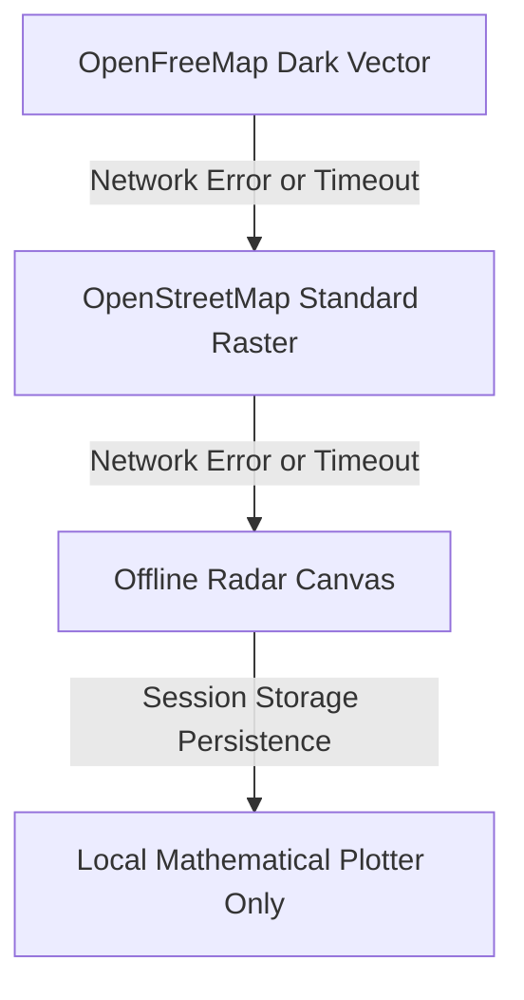

# Map Tile Configuration & Attribution Guide (TILES.md)

LORAN LAB renders station networks, geodesic baselines, hyperbolic lines of position (LOPs), and receiver fixes on an interactive MapLibre GL basemap.

---

## 1. Centralized Tile Architecture

All map tile providers, styles, and fallback chains are configured in [`src/lib/tiles.js`](../src/lib/tiles.js). The application supports dynamic tile provider switching directly from the tactical map interface:

| Provider | Type | URL / Style Endpoint | Attribution | Terms & Usage Limits |
|---|---|---|---|---|
| **OpenFreeMap Dark** *(Default)* | Vector (JSON / PBF) | `https://tiles.openfreemap.org/styles/dark` | © OpenStreetMap contributors © OpenFreeMap | Free and open-source map hosting (Hyperknot Software Kft.). Keyless, no rate limits, no tracking, zero watermarks. Provided "as-is" without formal SLA. Terms: [openfreemap.org](https://openfreemap.org) |
| **OpenStreetMap Standard** *(Fallback 1)* | Raster (PNG) | `https://tile.openstreetmap.org/{z}/{x}/{y}.png` | © OpenStreetMap contributors | Standard community raster fallback basemap. Keyless; subject to [OSMF Tile Usage Policy](https://operations.osmfoundation.org/policies/tiles/) |
| **CARTO Dark** *(Optional Auth)* | Raster (PNG) | `https://basemaps.cartocdn.com/dark_all/{z}/{x}/{y}.png?api_key=<KEY>` | © OpenStreetMap contributors © CARTO | Optional authenticated basemap. Requires `VITE_CARTO_API_KEY` environment variable. Never hardcoded. Governed by [CARTO Basemap Terms](https://carto.com/legal/basemap-terms/) |
| **Offline Radar Canvas** *(Fallback 2)* | Synthetic Canvas | `null` (Local client vector) | LORAN LAB Synthetic Grid | Zero-network fallback; renders pure dark radar canvas with high-contrast station markers and hyperbolic LOPs |

---

## 2. OpenFreeMap Vector Integration & Reliability Framing

As of September 2026, CARTO began enforcing an API key on its public raster endpoints, rendering keyless requests with diagonal "API KEY REQUIRED" watermarks.

To maintain an unwatermarked, keyless, and production-ready experience by default, LORAN LAB defaults to **OpenFreeMap Dark**:
- **Format**: Vector MapLibre style JSON with vector tile layers (`openmaptiles`), Natural Earth shaded relief, sprites, and PBF glyphs.
- **Provider Terms**: Quoted from [OpenFreeMap Terms & About](https://openfreemap.org):
  > *"OpenFreeMap is a free and open-source map service provided by Hyperknot Software Kft. It is completely free for commercial and non-commercial use. No API keys, no tracking, no limits."*
- **SLA & Reliability**: OpenFreeMap is operated as a donation-funded community service with **no formal SLA or uptime guarantee**.
- **Attribution Requirement**: Quoted from OpenFreeMap guidelines:
  > *"Map data © OpenStreetMap contributors, Style & Hosting © OpenFreeMap."* Displayed in MapLibre's attribution control.

---

## 3. Automated Progressive Fallback Chain

Because OpenFreeMap operates without an SLA, LORAN LAB implements an automated multi-tier fallback chain (`FALLBACK_CHAIN = ['openfreemap-dark', 'osm-standard', 'offline-radar']`):



1. **Tier 1 — OpenStreetMap Raster Fallback**: If OpenFreeMap vector styles, tile endpoints, or sprite servers fail to respond, the map automatically promotes OpenStreetMap standard raster tiles and displays a dismissible warning notice.
2. **Tier 2 — Offline Radar Canvas Fallback**: If external internet connectivity is completely lost, or if OSM tiles are also blocked, the map automatically transitions to the zero-network Radar Canvas.
3. **Session Persistence**: When Radar Canvas is activated by network failure, the state is persisted in `sessionStorage` (`loran_offline_radar = 'true'`) to avoid repeated network failures during subsequent route navigation.

---

## 4. CARTO API Key Integration & Credential Hygiene

For deployments wishing to use CARTO raster basemaps:
- **Environment Gated**: The application reads the key strictly from `import.meta.env.VITE_CARTO_API_KEY`.
- **Zero Credentials in Git**: CARTO API keys are **never** committed or hardcoded into source code, test suites, or configuration files.
- **Client Bundle Warning**: Because frontend single-page applications run in client browsers, any key set in `VITE_CARTO_API_KEY` is visible in client network traffic. Users must restrict the key by HTTP referer / origin in the [CARTO Basemap Dashboard](https://dashboard.basemaps.carto.com).
- **Graceful Behavior Without Key**: If `VITE_CARTO_API_KEY` is not set in the environment, selecting CARTO in the UI alerts the user to configure the variable rather than issuing unauthenticated requests that receive watermarked tiles.

---

## 5. Configuring Custom or Self-Hosted Tile Servers

To configure a private tile server or enterprise tile provider (e.g., self-hosted OpenFreeMap, OpenMapTiles, or MapTiler), modify or extend `TILE_PROVIDERS` in [`src/lib/tiles.js`](../src/lib/tiles.js):

```javascript
export const TILE_PROVIDERS = {
  'custom-server': {
    id: 'custom-server',
    name: 'Internal Lab Tile Server',
    type: 'raster',
    url: 'https://tiles.internal.lab/{z}/{x}/{y}.png',
    attribution: 'Internal Geographic Survey',
    maxZoom: 18,
    tileSize: 256,
  },
};
```
