# SIMULORAN: Visual User Guide & Operational Manual
## Complete Step-by-Step Interface Walkthrough, Feature Reference & Engineering Workflows

---

### Table of Contents
1. [System Architecture & UI Anatomy](#1-system-architecture--ui-anatomy)
2. [Home Dashboard & Scenario Selection](#2-home-dashboard--scenario-selection)
3. [Loran-C Hyperbolic Navigation & Chain Design](#3-loran-c-hyperbolic-navigation--chain-design)
4. [Modernized eLoran All-in-View Positioning](#4-modernized-eloran-all-in-view-positioning)
5. [Station Engineering & Network Management](#5-station-engineering--network-management)
6. [Geometric Dilution of Precision (GDOP) Contours](#6-geometric-dilution-of-precision-gdop-contours)
7. [Electromagnetic Groundwave & Millington ASF Modeling](#7-electromagnetic-groundwave--millington-asf-modeling)
8. [Oscillator Timing, Clock Drift & Allan Variance](#8-oscillator-timing-clock-drift--allan-variance)
9. [Resilient Multi-Sensor Fusion & Electronic Warfare](#9-resilient-multi-sensor-fusion--electronic-warfare)
10. [Kinematic Trajectory & Waypoint Navigation](#10-kinematic-trajectory--waypoint-navigation)
11. [Live Telemetry Stream, Diagnostics & NMEA-0183](#11-live-telemetry-stream-diagnostics--nmea-0183)
12. [RF Waveforms Laboratory & Pulse Oscilloscope](#12-rf-waveforms-laboratory--pulse-oscilloscope)
13. [Ionospheric Skywave Reflection & Doherty Analysis](#13-ionospheric-skywave-reflection--doherty-analysis)
14. [Cycle Selection, Envelope Tracking & SDR Lab](#14-cycle-selection-envelope-tracking--sdr-lab)
15. [Loran Data Channel (LDC) & Reed-Solomon Decoding](#15-loran-data-channel-ldc--reed-solomon-decoding)
16. [Educational Theory & Empirical Validation](#16-educational-theory--empirical-validation)
17. [Operational Recipes & Troubleshooting](#17-operational-recipes--troubleshooting)

---

## 1. System Architecture & UI Anatomy

SIMULORAN is organized as a high-density, dark-mode cockpit designed for radionavigation engineers, researchers, and students. The interface layout consists of four persistent components:

```
+----------------------------------------------------------------------------------------------------+
| Top Navbar: Route Navigation | Active Scenario Badge | Play/Pause Simulation | Theme Toggle | GitHub|
+------------------------------------------------------------------+---------------------------------+
|                                                                  |                                 |
|                                                                  | Sidebar Subsystem Panels:       |
|                                                                  | - Station Network Editor        |
|                                                                  | - Clocks & Allan Deviation      |
| Interactive Vector Map / Waveform Workbench Canvas               | - Additional Secondary Factor   |
| - Transmitter Nodes (Master / Secondary)                         | - d-Loran Differential Monitor  |
| - Hyperbolic Lines of Position (LOPs) / Range Circles            | - Receiver Tracking Loops       |
| - Real-time GDOP / HDOP Heatmap Contours                         | - Trajectory & Flight Plan      |
| - Receiver Fix & Error Ellipse                                   | - Multi-Sensor BLUE Fusion      |
|                                                                  | - Display & Layer Toggles       |
|                                                                  |                                 |
+------------------------------------------------------------------+---------------------------------+
| Collapsible Live Telemetry Console: NMEA Sentences | Residuals | Serial Terminal | Log Export      |
+----------------------------------------------------------------------------------------------------+
```

- **Top Navbar**: Instant routing between `/` (Home), `/loran-c` (Hyperbolic Mode), `/eloran` (Pseudorange Mode), `/waveforms` (RF Signal Lab), `/learn` (Interactive Theory), and `/about` (Field Trials & Provenance).
- **Interactive Map Canvas**: Accelerated MapLibre GL engine with vector tiles, real-time Canvas 2D overlay for hyperbolic curves, and off-thread Web Worker computation for GDOP contour grids.
- **Collapsible Sidebar**: Resizable panel with draggable divider (`280px` to `640px`) hosting 8 specialized navigation subsystems.
- **Dockable Telemetry Console**: Real-time NMEA-0183 streamer (`$GPRMC`, `$GPGGA`, `$PSIMLOR`), serial bridge monitor, and CSV/JSON log exporter.

---

## 2. Home Dashboard & Scenario Selection

The Home page provides high-level system diagnostics, feature summaries, and direct scenario launchers.

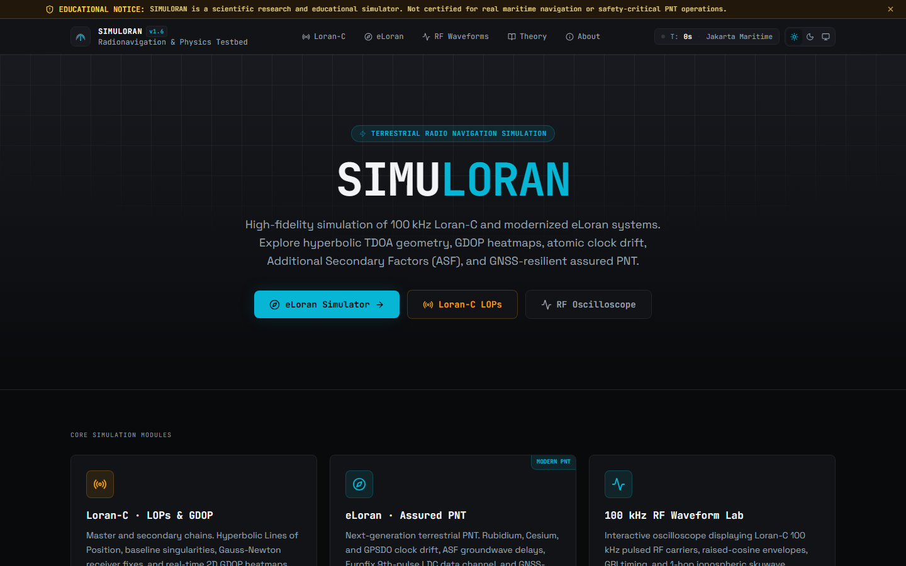

### Key Controls & Capabilities
- **Quick Launch Buttons**: Launch immediately into either legacy **Loran-C (Hyperbolic)** or modernized **eLoran (All-in-View)** simulation.
- **Feature Cards**: Direct links into core modules (Hyperbolic Positioning, ASF Terrain Attenuation, Resilient Multi-Sensor Fusion, and Oscillator Stability).
- **Standards Badge Grid**: Highlights compliance with USCG M16562.4A, RTCM SC-127, IALA R-129, and ITU-R P.368-9.

### Calibrated Operational Scenarios
Scrolling down reveals the **Scenario Presets** catalog:

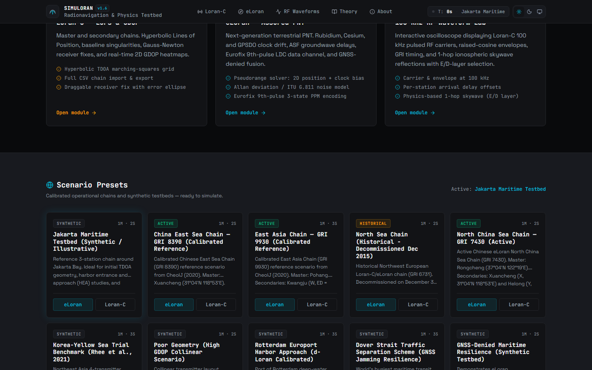

| Preset Scenario | GRI | Masters | Secondaries | Description |
| :--- | :--- | :--- | :--- | :--- |
| **Northeast US (Historical)** | `9960` | Seneca (M) | Caribou (W), Nantucket (X), Carolina Beach (Y), Dana (Z) | Complete calibrated USCG chain with Atlantic maritime baselines. |
| **Korean Nationwide Testbed** | `9930` | Pohang (M) | Kwangju (W), Ulleungdo (X), Incheon (Y) | Active modernized eLoran testbed with high-precision dLoran monitors. |
| **North Sea Chain** | `6731` | Lessay (M) | Soustons (W), Sylt (X), Bø (Y) | European Loran-C network configuration with mixed sea/land paths. |
| **Gulf of Mexico** | `7980` | Malone (M) | Grangeville (W), Raymondville (X), Jupiter (Y) | Deep marine coverage and coastal marsh propagation modeling. |
| **Maoming Inland Baseline** | `8390` | Maoming (M) | Station 1 (W), Station 2 (X) | Dedicated inland high-attenuation testbed for Millington verification. |

> [!TIP]
> Click **"Launch in eLoran"** on any scenario card to immediately populate the map with official station coordinates, calibrated radiated powers (ERP), and accurate emission delays.

---

## 3. Loran-C Hyperbolic Navigation & Chain Design

The `/loran-c` route simulates classical hyperbolic radionavigation where the receiver measures differential time differences (TDOA) relative to a designated Master station.


### Layout Components
1. **Master Station (M)**: Displayed as a gold pulsing beacon with radiated power rings.
2. **Secondary Stations (W, X, Y, Z)**: Displayed as cyan stations connected by dashed geodesic baselines.
3. **Hyperbolic Lines of Position (LOPs)**:
   - Curved hyperbolas representing constant time difference contours:
     $$\text{TD}_i = (T_{\text{arr}, i} + \text{ED}_i) - T_{\text{arr}, M} = \text{constant}$$
   - LOP intersections determine the receiver's horizontal position fix.
4. **Baseline Extensions**: Highlighted zones along the station-to-station axis where hyperbolic geometry degenerates into a single line, causing severe geometric dilution of precision.

### Chain Design Panel

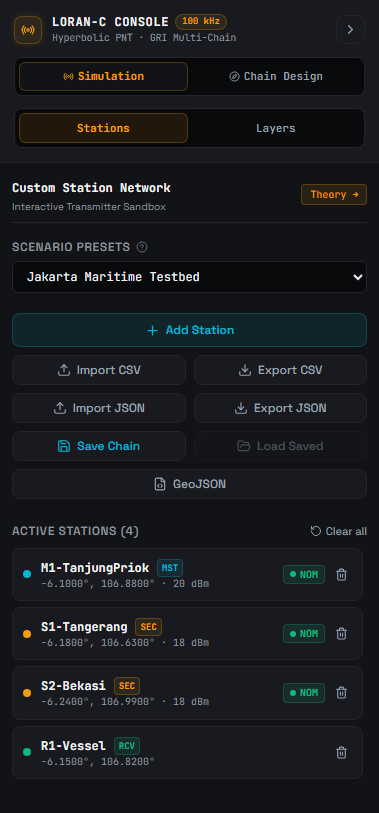

- **GRI Selector**: Set Group Repetition Interval in microseconds (e.g., $9960 \implies 99\,600\,\mu\text{s}$).
- **Emission Delay (ED) Tuning**: Adjust secondary transmission delays ($10\,000\,\mu\text{s}$ to $90\,000\,\mu\text{s}$) to prevent pulse collisions across the coverage envelope.
- **Baseline Length Readout**: Exact WGS-84 ellipsoidal distance and azimuth between Master and each Secondary.

---

## 4. Modernized eLoran All-in-View Positioning

The `/eloran` route represents next-generation terrestrial PNT where every station is synchronized to UTC via atomic standards.


### Core Advancements over Legacy Loran-C
- **Time-of-Arrival (TOA) Mode**: Direct pseudorange multilateration without requiring a Master station:
  $$\rho_i = c \cdot (T_{\text{TOA}, i} - T_{\text{TX}, i}) = \|\mathbf{x} - \mathbf{s}_i\| + c \cdot \delta t_{\text{rx}} + \text{PF}_i + \text{SF}_i + \text{ASF}_i + \epsilon_i$$
- **Cross-Chain Fix**: Seamlessly tracks transmitters across multiple GRIs simultaneously.
- **Receiver Fix & 95% Confidence Ellipse**: Real-time position estimate calculated via damped Levenberg-Marquardt least squares with eigen-decomposed uncertainty axes.

---

## 5. Station Engineering & Network Management

Custom transmitters can be engineered or edited directly on the map or via the **Station Network Editor**.

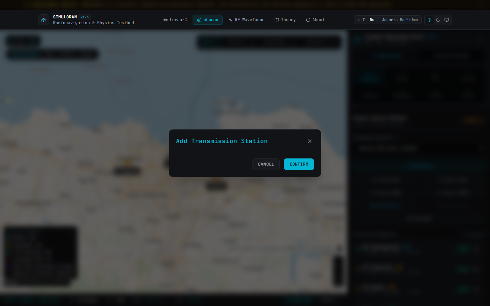

### Parameter Specifications
- **Station Call-sign / Identifier**: Name and alphanumeric code (e.g. `SEN`, `CAR`).
- **WGS-84 Geodetic Coordinates**: Latitude and Longitude with micro-degree precision ($< 0.1\text{ m}$ accuracy).
- **Effective Radiated Power (ERP)**: Radiated RF power from $50\text{ kW}$ to $1200\text{ kW}$.
- **Antenna Mast Height**: Top-loaded monopole physical height ($150\text{ m}$ to $400\text{ m}$), determining low-angle groundwave radiation efficiency.
- **Nominal Coding Delay & Phase Code Group**: Group A or Group B phase rotation sequences.
- **Status Override**: Toggle between *Active*, *Off-Air*, *Unusable*, or *Blinking* (Loran integrity alert).

---

## 6. Geometric Dilution of Precision (GDOP) Contours

Activating the **Layers Tab** enables real-time spatial coverage and precision mapping.


### Heatmap Interpretation
- **Green / Cyan (GDOP < 2.0)**: Optimal station geometry. Lines of position intersect near orthogonal angles ($\sim 90^\circ$).
- **Yellow / Orange (2.0 <= GDOP <= 5.0)**: Acceptable navigation geometry. Typical for mid-range marine coverage.
- **Red / Magenta (GDOP > 10.0)**: Severe geometric degradation. Occurs near baseline extensions and outer chain perimeters.
- **Coverage Masking**: Areas where received signal strength falls below receiver sensitivity ($-10\text{ dB}\mu\text{V/m}$) or where SNR $< -20\text{ dB}$ are automatically blanked.

> [!NOTE]
> The GDOP rasterizer runs asynchronously in an off-thread Web Worker, guaranteeing smooth 60 FPS map panning and zooming without blocking the main browser thread.

---

## 7. Electromagnetic Groundwave & Millington ASF Modeling

The **ASF Subsystem** models how terrestrial soil conductivity retards 100 kHz radio waves relative to pure seawater.


### Groundwave Delay Components
1. **Primary Factor (PF)**: Atmospheric tropospheric delay ($n_{\text{atm}} = 1.000338$, $v_{\text{phase}} \approx 299\,691\,162.8\text{ m/s}$).
2. **Secondary Factor (SF)**: Continuous Brunavs (1977) seawater model eliminating legacy step discontinuities.
3. **Additional Secondary Factor (ASF)**: Extra phase lag induced by inhomogeneous terrestrial paths:
   $$\Phi_{\text{Millington}} = \frac{\Phi_{\text{forward}} + \Phi_{\text{reverse}}}{2}$$
   $$T_{\text{ASF}} = \Phi_{\text{Millington}} - T_{\text{SF}}$$

### Interactive Controls
- **Terrain Segment Editor**: Define multi-segment paths with custom segment lengths and soil conductivities ($\sigma \in [0.0001, 5.0]\text{ S/m}$).
- **Conductivity Presets**: Seawater ($5.0\text{ S/m}$), Marshland ($0.02\text{ S/m}$), Fresh Water ($0.01\text{ S/m}$), Rich Agricultural Soil ($0.005\text{ S/m}$), Rocky Hills ($0.002\text{ S/m}$), Mountainous Rock ($0.001\text{ S/m}$), Polar Ice ($0.0001\text{ S/m}$).
- **Reciprocity Monitor**: Displays real-time forward vs. reverse phase delay matching.

---

## 8. Oscillator Timing, Clock Drift & Allan Variance

The **Clocks Subsystem** simulates local oscillator stability and long-term time transfer.

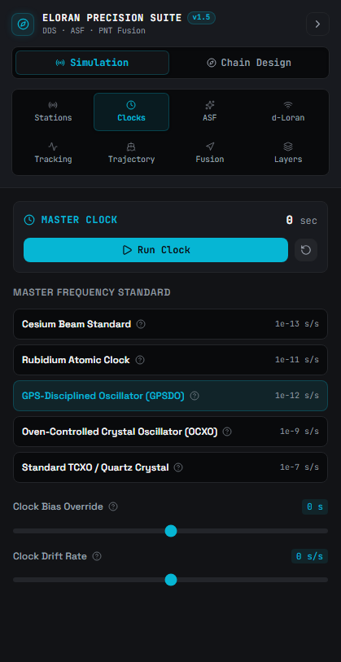

### Modeled Oscillator Standards
- **Cesium Beam Frequency Standard**: Primary timing reference. Stability $\sim 10^{-14}$ at $\tau = 10^4\text{ s}$.
- **Rubidium Gas Cell Standard**: Operational eLoran transmitter standard. Stability $\sim 2 \times 10^{-12}$ at $\tau = 100\text{ s}$.
- **Oven-Controlled Crystal Oscillator (OCXO)**: High-end navigation receiver clock. Stability $\sim 10^{-11}$ at $\tau = 1\text{ s}$.
- **Temperature-Compensated Quartz (TCXO)**: Commercial low-cost clock with thermal drift and white phase noise.

### Features
- **Two-State Markov Clock Simulation**: Integrated phase bias $x(t)$ and fractional frequency offset $y(t)$.
- **Live Allan Deviation $\sigma_y(\tau)$ Plot**: Computes Allan deviation over averaging intervals $\tau \in [1, 10\,000]\text{ s}$ to isolate white phase, flicker phase, and random-walk frequency noise.
- **UTC Time Transfer Offset**: Evaluates microsecond offset relative to UTC(BIPM).

---

## 9. Resilient Multi-Sensor Fusion & Electronic Warfare

The **Fusion Subsystem** models how eLoran acts as an impenetrable sovereign backup when GNSS signals are jammed or spoofed.


### Resilience Simulator Controls
- **GNSS Outage Simulation**: Induces complete GNSS loss-of-lock. System automatically switches to eLoran autonomous navigation.
- **GNSS Spoofing Vector**: Injects slow-drift or step-displacement spoofing into satellite pseudoranges.
- **BLUE Estimator (Best Linear Unbiased Estimator)**:
  - Dynamically weights measurements inversely proportional to their error variance:
    $$w_i = \frac{1}{\sigma_i^2}$$
  - Cross-checks GNSS against eLoran ground truth to reject spoofed satellite fixes.
- **Kinematic 6-State Extended Kalman Filter (EKF)**:
  - State vector $\mathbf{x} = [x, \dot{x}, y, \dot{y}, c\delta t, c\dot{\delta t}]^T$.
  - Continuous velocity and clock drift propagation during high-g maneuvers.

---

## 10. Kinematic Trajectory & Waypoint Navigation

The **Trajectory Flight Planner** allows users to steer a virtual vessel, vehicle, or aircraft through the transmitter coverage area.

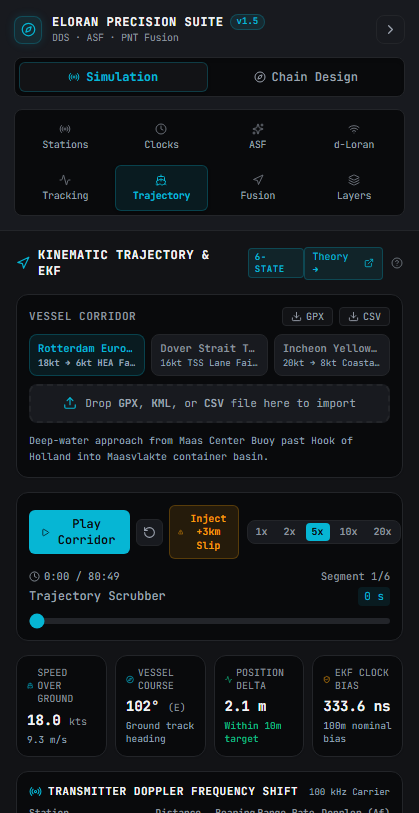

### Flight Plan Management
- **Waypoint Creation**: Add waypoints by clicking on the map or inputting WGS-84 coordinates.
- **Cruising Speed & Heading**: Set velocity from $5\text{ knots}$ (maritime vessel) to $600\text{ knots}$ (high-speed aircraft).
- **Turn Rate & Heading Smoothing**: Realistic kinematic bank angles and rate-of-turn maneuvers.
- **Real-Time Cross-Track Error (XTE)**: Visualizes cross-track displacement between planned trajectory and eLoran estimated track.

---

## 11. Live Telemetry Stream, Diagnostics & NMEA-0183

The **Telemetry Console** docks at the bottom of the viewport and expands to reveal serial sentence logs and signal diagnostics.

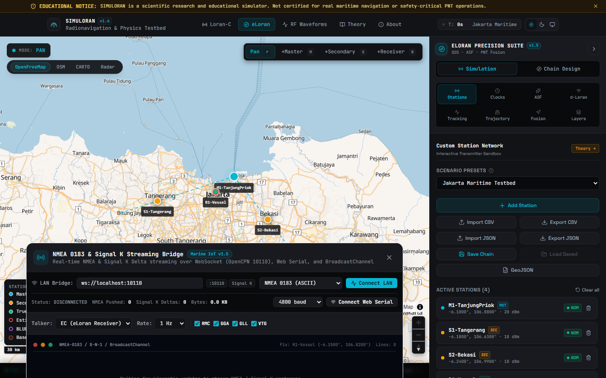

### Telemetry Features
- **Live Sentence Stream**: Real-time generation of standard NMEA-0183 sentences:
  - `$GPRMC`: Recommended Minimum Specific GNSS Data.
  - `$GPGGA`: Global Positioning System Fix Data.
  - `$PSIMLOR`: Proprietary Simuloran eLoran diagnostic sentence containing active GRI, SNR, tracking status, and protection levels.
- **Real-Time Residual Sparklines**: Plots pseudorange innovation errors across all tracked stations.
- **Integrity Status**: Chi-squared ($\chi^2$) RAIM test results and Horizontal Protection Level (HPL) status.

### Marine Bridge NMEA Terminal Modal

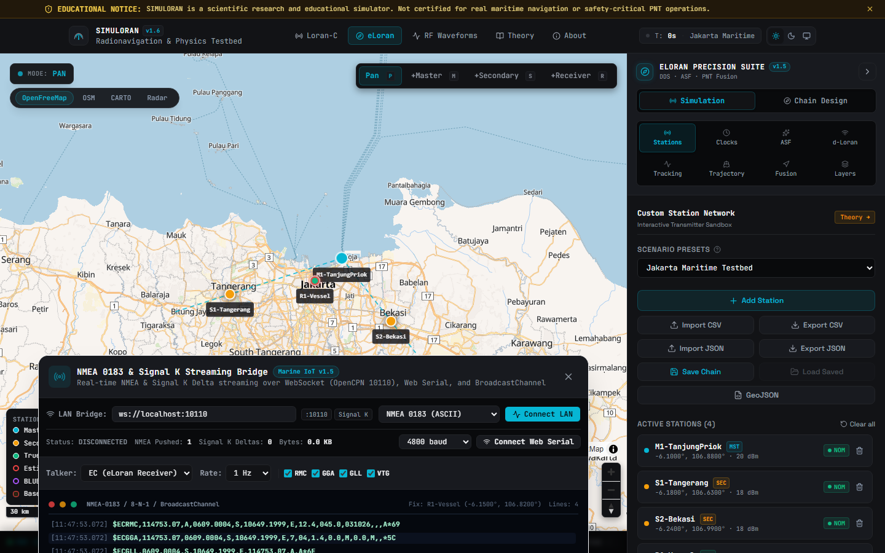

- **Dedicated Serial Console**: Displays raw hexadecimal and ASCII sentence buffers.
- **Checksum Verification**: Validates 8-bit XOR checksums for every transmitted frame.
- **Export Options**: Download flight logs in JSON or CSV format for external analysis in MATLAB, Python, or GIS tools.

---

## 12. RF Waveforms Laboratory & Pulse Oscilloscope

Located at `/waveforms`, this interactive laboratory provides real-time oscilloscope analysis of 100 kHz pulse dynamics.


### Oscilloscope Controls
- **Timebase & Scale**: Zoom from $0\text{ }\mu\text{s}$ to $120\text{ }\mu\text{s}$ across the pulse envelope.
- **Envelope Cursor**: Interactive cursor displaying exact time $t$, normalized envelope amplitude $e(t)$, and derivative $\frac{de}{dt}$.
- **SZC Tracking Marker**: Identifies the 3rd positive zero crossing at $t = 30.0\,\mu\text{s}$ ($e(30) = 0.62534$).
- **Spectral Analyzer**: Real-time Fast Fourier Transform (FFT) verifying that 99% of radiated energy falls strictly between $90\text{ kHz}$ and $110\text{ kHz}$.

---

## 13. Ionospheric Skywave Reflection & Doherty Analysis

The **Skywave Tab** simulates nocturnal ionospheric reflection and multi-hop interference.

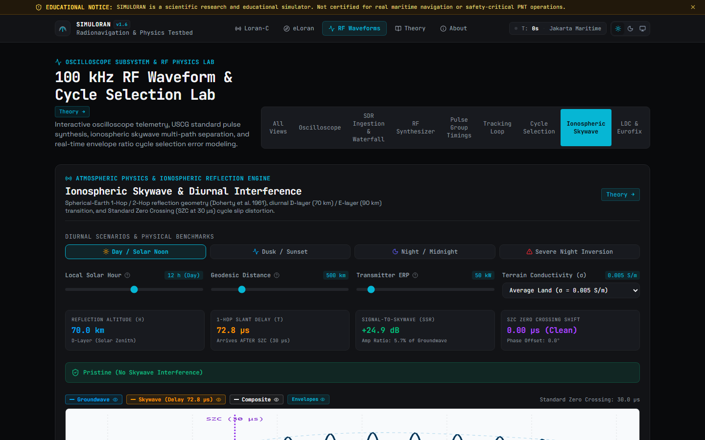

### Governing Parameters
- **Diurnal Solar Time Slider**: Smoothly transitions virtual ionospheric reflection height from $70\text{ km}$ (Day D-layer) to $90\text{ km}$ (Night E-layer).
- **Doherty Spherical 1-Hop Slant Range**: Calculates geometric slant distance $L_{\text{slant}}(d, h)$ over a curved Earth:
  $$\tau_{\text{sky}} = \frac{L_{\text{slant}} - d}{c}$$
- **Signal-to-Skywave Ratio (SSR)**: Measures relative decibel margin between groundwave and reflected skywave.
- **Cycle Slip Indicator**: Alerts when skywave arrival occurs before $35\,\mu\text{s}$ with $\text{SSR} < 10\text{ dB}$, warning of destructive $\pm 10\,\mu\text{s}$ cycle errors.

---

## 14. Cycle Selection, Envelope Tracking & SDR Lab

The **Cycle Selection & SDR Tabs** model receiver front-end carrier recovery and cycle ambiguity resolution.

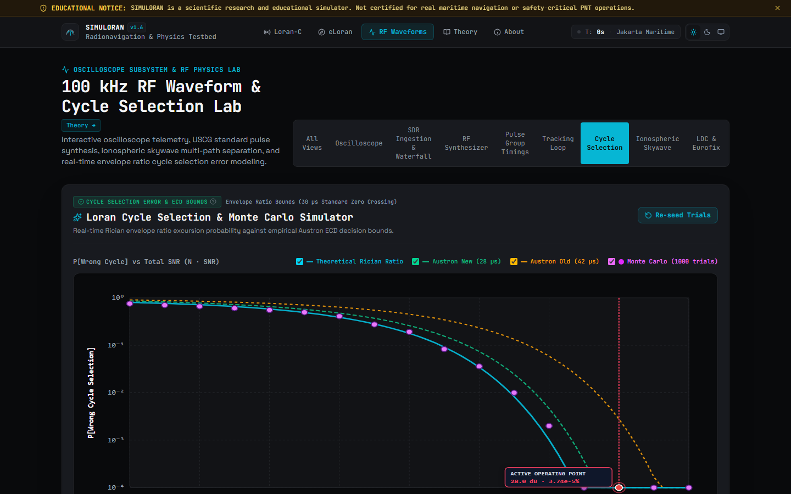

### Boyce Envelope Ratio Test
- **Metric**: Evaluates the ratio $R(t) = \frac{e(t+2.5)}{e(t-2.5)}$ (or half-cycle ratio $\frac{e(25)}{e(35)} \approx 0.395$).
- **Monotonicity**: Proves that envelope ratio is strictly monotonic on $t \in [15, 45]\,\mu\text{s}$, guaranteeing robust cycle identification even under severe noise.
- **Monte Carlo Simulator**: Injects Gaussian noise and envelope dispersion to compute empirical cycle selection error probabilities ($P_{\text{error}}$ vs. SNR).

### Software Defined Radio (SDR) Signal Lab

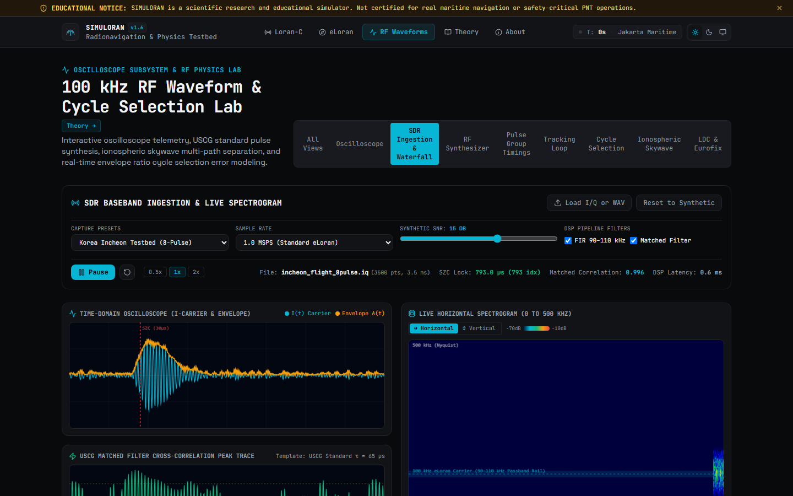

- **I/Q Constellation**: Real-time In-phase and Quadrature signal decomposition.
- **Matched Filter Correlator**: Cross-correlates received antenna stream against stored ideal USCG pulse templates to deliver $+23\text{ dB}$ processing gain.

---

## 15. Loran Data Channel (LDC) & Reed-Solomon Decoding

Modernized eLoran transmits digital data by modulating the 9th and 10th pulses of each emission group.


### LDC Specifications
- **32-Pulse Position Modulation (32-PPM)**: 5 bits per pulse via microsecond offsets:
  $$\Delta t_m = m \times 1.25\,\mu\text{s}, \quad m \in \{0, 1, \dots, 31\}$$
- **Reed-Solomon RS(31, 15) Code**:
  - Encoded over $\text{GF}(2^5)$ with primitive polynomial $p(x) = x^5 + x^2 + 1$.
  - Corrects up to 8 symbol errors (40 corrupted bits) per frame.
- **CRC-16-CCITT**: Ensures 100% integrity of broadcast differential corrections, UTC time tags, and station health warnings.

---

## 16. Educational Theory & Empirical Validation

### Interactive Learn Theory (`/learn`)


Provides an academic compendium with rendered KaTeX formulas, interactive wave visualizations, and geodetic coordinate calculators.

### Field Trial Validation & Provenance (`/about`)


Exhibits empirical benchmarks validating Simuloran against real-world experimental campaigns:
- **Korean Nationwide eLoran Testbed (2021)**: Validates pseudorange tracking, dLoran differential corrections, and harbor navigation accuracy ($< 10\text{ m}$ 95%).
- **Maoming Inland Geodesic Campaign (2025)**: Validates Millington mixed-path attenuation models across high-loss continental terrain.

---

## 17. Operational Recipes & Troubleshooting

### Recipe 1: How to Set Up an Operational Chain
1. Open `/eloran`.
2. Open the **Stations Subsystem** tab in the sidebar.
3. Select a geographical preset from the **Scenario Presets** dropdown (e.g. *Northeast US*).
4. Click the **Play/Pause** button in the top navbar to start real-time kinematic simulation.
5. Inspect the green receiver icon on the map to view real-time horizontal coordinates and estimated error.

### Recipe 2: How to Evaluate GDOP Coverage
1. Open the **Layers Subsystem** tab.
2. Toggle **"Live GDOP Coverage Overlay"** to ON.
3. Observe the colored contour zones. If GDOP exceeds 5.0 in your area of interest, open **Station Editor** and add a secondary transmitter orthogonal to the existing baseline.

### Recipe 3: How to Diagnose a 10 µs Cycle Slip
1. Open `/waveforms` and select the **Skywave** tab.
2. Advance the **Solar Time** slider from 12:00 (Noon) to 00:00 (Midnight).
3. Observe how ionospheric virtual reflection height increases to $90\text{ km}$ and absorption drops to $8\text{ dB}$.
4. When Signal-to-Skywave Ratio (SSR) drops below $10\text{ dB}$, note that the 3rd zero crossing shifts by $> 90^\circ$, triggering the red **"Cycle Slip Warning"** badge.
