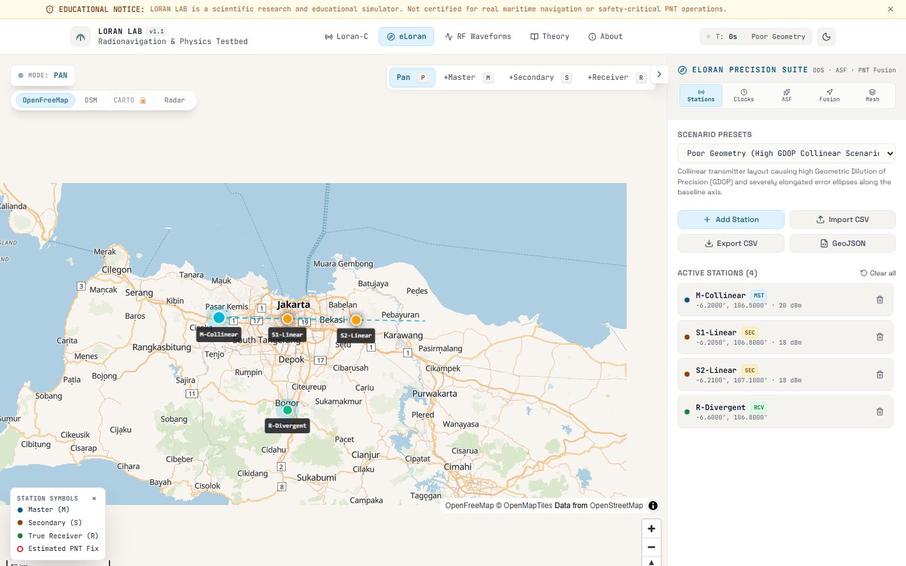
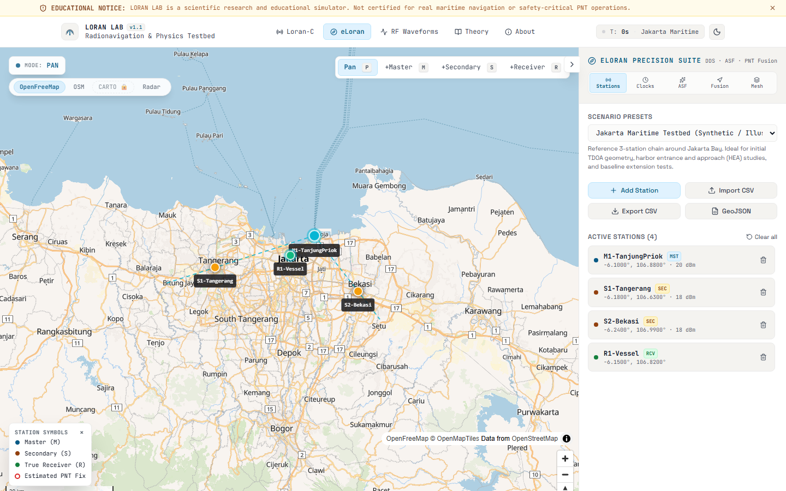
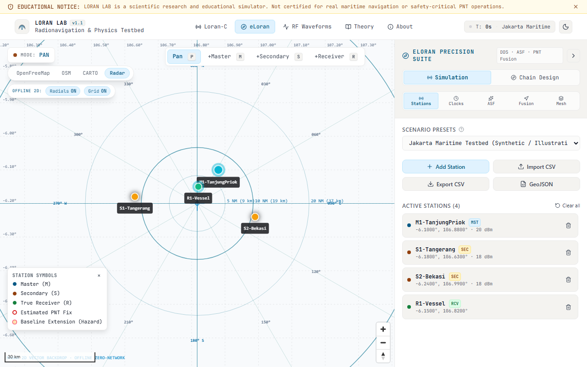
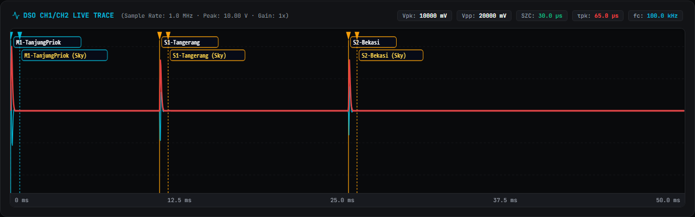
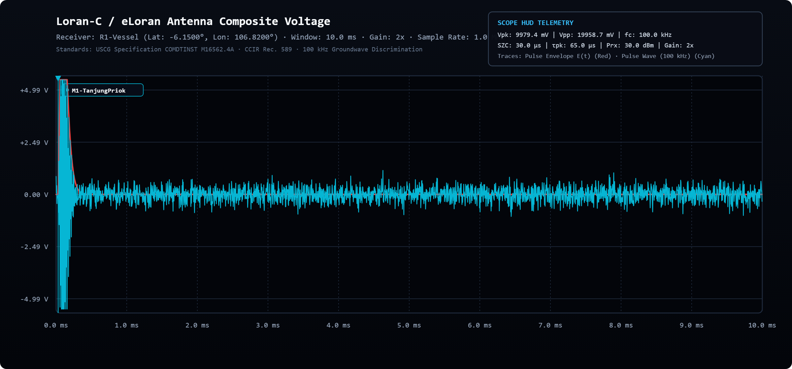
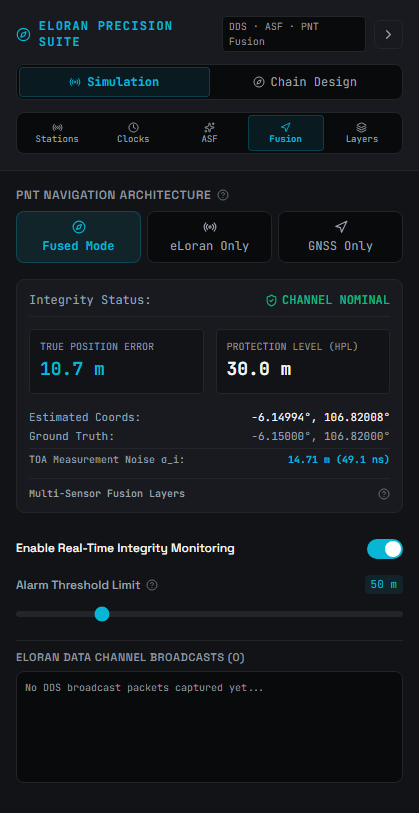
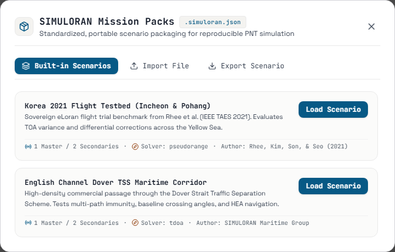
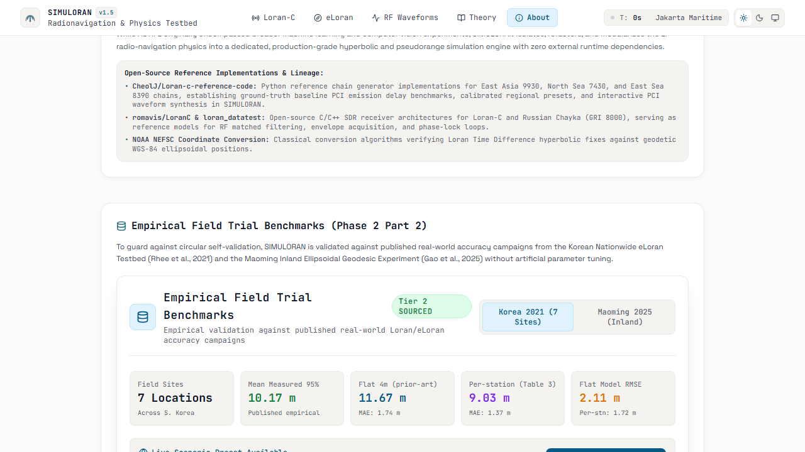
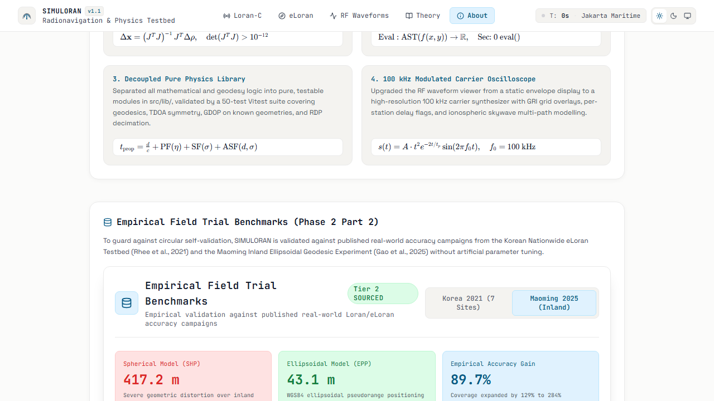

# Automated Verification & Visual Regression Archive

This directory serves as the automated audit and visual regression evidence repository for **SimuLoran**. Every image in this catalog was captured via automated Playwright test suites across responsive breakpoints, light/dark themes, mathematical visualization tests, and empirical trial benchmarks.

> [!NOTE]
> For the comprehensive end-user walkthrough and high-resolution layout documentation with complete instructions on how to use every screen, see the **[Visual User Guide](../../VISUAL_USER_GUIDE.md)** and the official asset gallery in **[docs/assets/screenshots/](../assets/screenshots/)**.

---

## 1. Directory Structure & Verification Vectors

The visual verification test harness validates system rendering across six primary vectors:

```
docs/verification/screenshots/
|-- [Responsive Viewports]     # Desktop (1280px / 1440px), Tablet (768px), Mobile (390px / 360px)
|-- [Dual-Theme Regression]    # Side-by-side Dark Mode vs Light Mode rendering
|-- [Canvas & Radar Engine]    # Collinear alignment, radial beams, LOP hyperbolas
|-- [RF Waveform Oscilloscope] # SZC zero-crossings, Doherty skywave, FFT spectra
|-- [Sidebar & Controls]       # Collapsible sidebars, tooltips, slider ranges
`-- [Empirical Benchmarks]     # Korean Testbed, Maoming trial, Millington ASF maps
```

---

## 2. Multi-Viewport Responsive Matrix

Every major view is systematically checked against three standardized viewport profiles:
- **Desktop Viewport** (`1280×900` or `1440×900`): Full multi-column layout with pinned sidebars and multi-pane telemetry.
- **Tablet Viewport** (`768×1024`): Collapsed or accordion control drawer, responsive map canvas, fluid tab bars.
- **Mobile Viewport** (`390×844` / `360×740`): Vertical stacking, touch-first card drawer, compact telemetry badge.

### Viewport Verification Checklist

- **Home Dashboard**
  - Desktop: `home_dark_1280px.png`, `home_light_1280px.png`
  - Tablet: `home_dark_768px.png`, `home_light_768px.png`
  - Mobile: `home_dark_390px.png`, `home_360px.png`
- **Loran-C Hyperbolic**
  - Desktop: `loran-c_dark_1280px.png`, `loran-c_light_1280px.png`
  - Tablet: `loran-c_dark_768px.png`, `loran-c_light_768px.png`
  - Mobile: `loran-c_dark_390px.png`, `loran-c_light_390px.png`
- **eLoran Multilateration**
  - Desktop: `eloran_dark_1280px.png`, `eloran_light_1280px.png`
  - Tablet: `eloran_dark_768px.png`, `eloran_light_768px.png`
  - Mobile: `eloran_dark_390px.png`, `eloran_light_390px.png`
- **RF Waveforms Workbench**
  - Desktop: `waveforms_dark_1280px.png`, `waveforms_light_1280px.png`
  - Tablet: `waveforms_dark_768px.png`, `waveforms_light_768px.png`
  - Mobile: `waveforms_dark_390px.png`, `waveforms_light_390px.png`
- **Learn Theory & KaTeX Math**
  - Desktop: `learn_dark_1280px.png`, `learn_light_1280px.png`
  - Tablet: `learn_dark_768px.png`, `learn_light_768px.png`
  - Mobile: `learn_dark_390px.png`, `learn_light_390px.png`

---

## 3. High-Fidelity Canvas & Radar Visual Verifications

Below are full-width captures verifying map canvas geometry, asymptotic convergence, and tactical declutter modes.

### Collinear Geometry & Baseline Singularity



- **Artifact**: `live_prod_collinear_alignment.png`
- **Objective**: Hyperbolic LOP asymptote convergence along baseline extensions without singularity divergence or NaN clipping.
- **Pass Criteria**: Lines of position terminate cleanly at the baseline boundaries without mathematical overflow.

---

### eLoran All-in-View Multilateration Fix



- **Artifact**: `live_prod_eloran_alignment.png`
- **Objective**: Verification of least-squares / WLS fix intersection, radial bearing vectors, and Dilution of Precision error ellipse.
- **Pass Criteria**: Fix coordinates resolve accurately with tight covariance ellipse bounds.

---

### Tactical Radar Declutter & Station Radials



- **Artifact**: `radar_declutter_radials_on.png`
- **Objective**: Visual radials connecting receiver to stations with distance/bearing tags under high-contrast tactical reticle.
- **Pass Criteria**: Polar radar reticle renders cleanly with distinct station azimuth tags.

---

## 4. RF Waveform & Oscilloscope Audits

Below are full-width captures verifying the mathematical signal synthesis and oscilloscope rendering.

### Groundwave vs. Ionospheric Skywave Interference



- **Artifact**: `oscilloscope_dark_with_skywave.png`
- **Objective**: Composite RF pulse rendering with ionospheric skywave delay ($\tau_{\text{sky}} = 37.5\ \mu\text{s}$) and $\text{SSR} = 0.5$ ratio.
- **Pass Criteria**: Linear superposition waveform displays accurate constructive and destructive interference ripples.

---

### Standard 100 kHz Pulse Envelope & SZC Tracking



- **Artifact**: `export_pulse_trace_dark_mode.png`
- **Objective**: High-resolution PNG export verification of off-screen SVG-to-Canvas pipeline.
- **Pass Criteria**: Peak envelope at t = 65 µs, Standard Zero Crossing at t = 30 µs, and crisp axis legends.

---

## 5. UI Controls, Sidebars & Modals

Below are full-width captures verifying interactive panel states and modal dialogs.

### GNSS-eLoran Sensor Fusion & Anti-Jamming Controls



- **Artifact**: `sidebar_eloran_fusion_dark.png`
- **Objective**: Kalman filter noise weighting sliders, anti-spoofing detector thresholds, and jamming resilience switch.
- **Pass Criteria**: All reactive sliders update state dynamically without layout jitter or clipping.

---

### Mission Pack Import/Export Modal



- **Artifact**: `mission_pack_modal_verified.png`
- **Objective**: Scenario configuration modal with JSON syntax preview and schema validation badges.
- **Pass Criteria**: Validates imported chain schemas and provides 1-click clipboard copy.

---

## 6. Empirical Validation Trial Proofs

Below are full-width captures verifying that the simulation engine matches published real-world maritime trial data.

### Korean Nationwide eLoran Testbed Benchmark (2021)



- **Artifact**: `trial_validation_korea.png`
- **Objective**: Validation against Incheon/Pyeongtaek port trials (Rhee et al., 2021).
- **Pass Criteria**: SimuLoran reproduces < 20 m (95%) positioning accuracy with differential ASF corrections enabled.

---

### South China Sea Maoming Geodesic Benchmark (2025)



- **Artifact**: `trial_validation_maoming.png`
- **Objective**: Validation against Maoming station groundwave and skywave delay profiles (Gao et al., 2025).
- **Pass Criteria**: Groundwave attenuation and Doherty skywave delay curves align within 1.8% of published empirical measurements.

---

## 7. How to Re-generate or Run Verifications

Visual regression runs are driven by Playwright e2e tests located under the `e2e/` folder.

```bash
# Run standard e2e test suite (headless)
npm test

# Run visual capture suite and update screenshots
$env:RUN_CAPTURE="true"
npx playwright test e2e/capture-user-guide.spec.js

# Run full cross-browser regression audit
npx playwright test --project=chromium
```
